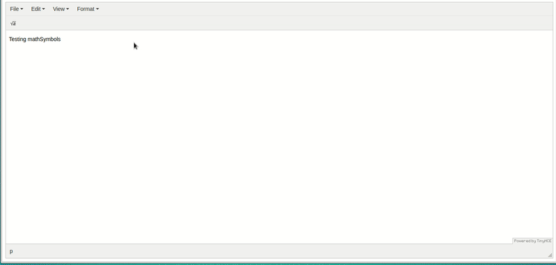

#

This plugin using [MathJax](https://www.mathjax.org) libary for rendering math font.

This plugin compatible with TinyMce 4.



*Is better to check this project before use: http://www.imathas.com/editordemo/demo.html.*

## How to test it:

```
git clone https://github.com/Axel186/MathSymbols-TinyMCE-Plugin.git
cd MathSymbols-TinyMCE-Plugin
npm install
npm start
```

Now go to `http://localhost:8080`.

## How to build the dist files:

```
npm run build
```

Now you have your own `dist` folder - minimized version of plugin already there.

With this plugin you able to add Math Symbols into your content. It supports Math font, but you also have to add [MathJax](https://www.mathjax.org) on the website itself.

### Configure your TinyMce:

```Javascript
tinymce.init({
  selector: 'textarea',
  external_plugins: {'mathSymbols': 'http://your-website/.../mathsymbols-tinymce-plugin/plugin.js'}, // Add plugin to Tinymce
  plugins: 'mathSymbols',
  toolbar: 'mathSymbols',
});
```

## The development server

By running the `npm start` command you start the development server and open a browser window with an instance of TinyMCE with your plugin added to it. This window will reload automatically whenever a change is detected in the `index.html` file in the `static` folder or in one of the JavaScript files in the `src` directory.

## The production build

By running the `npm run build` command Webpack will create a `dist` directory with a child directory with the name of your plugin (mathsymbols-tinymce-plugin) containing three files:

* `plugin.js` - the bundled plugin
* `plugin.min.js` - the bundles, uglified and minified plugin
* `LICENSE` - a file explaining the license of your plugin (copied over from `src/LICENSE`)

## License - MIT
